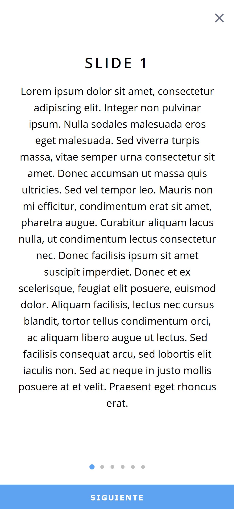

## Vue Onboard

Vue onboard is a template that helps to carry out various types of onboard, in this case, information or a form.

* VSlide Component: It is in charge of generating the information view, it is composed of a title, paragraph and actions (coming soon).
 ```js
slides: [
        {title: "Slide 1", text: "Text 1"},
        {title: "Slide 2", text: "Lorem Text 2."},
        {title: "Slide 3", text: "Pellentesque Text 3."},
        {title: "Slide 4", text: "Ut fermentum Text 4."},
        {title: "Slide 5", text: "Nunc a nulla libero Text 5"},
        {title: "Slide 6", text: "Nullam tempus Text 6."},
      ],
 ```
 <p align="center">
  
</p>

## Work with Vue Onboard

To be able to use it, you must work from a local server, since you are working with ES6 modules, for more information, you can consult here [ES6 module support in Chrome 62/Chrome Canary 64, does not work locally, CORS error](https://stackoverflow.com/questions/46992463/es6-module-support-in-chrome-62-chrome-canary-64-does-not-work-locally-cors-er?rq=1)

### Visual Studio Code
Puede descargar la extension 